<!--
# Table of Contents
 * [Electronics](#Electronics)
 * [Hardware](#Hardware)
-->

<!-- ----------------------------------------  -->
<!-- ----------------------------------------  -->
# Electronics

#### Arduino Mega
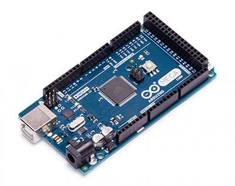

#### Arduino Uno
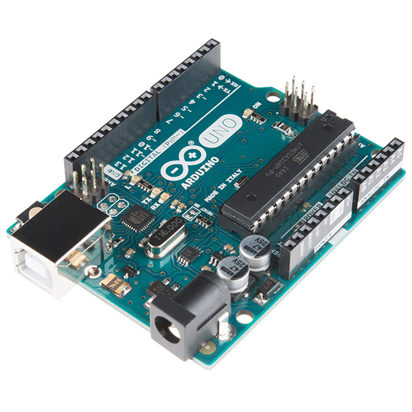

#### Arduino Leonardo
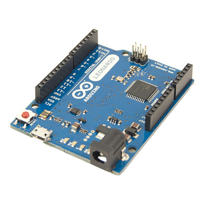

#### Arduino Pro Mini
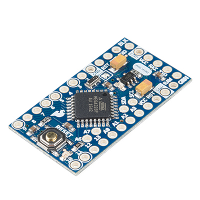

#### Arduino Nano
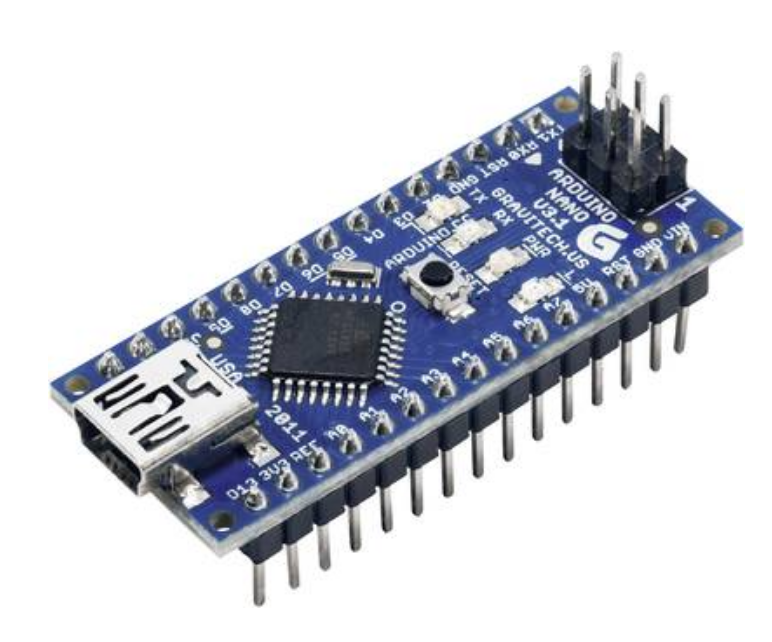

#### Arduino Program Downloader
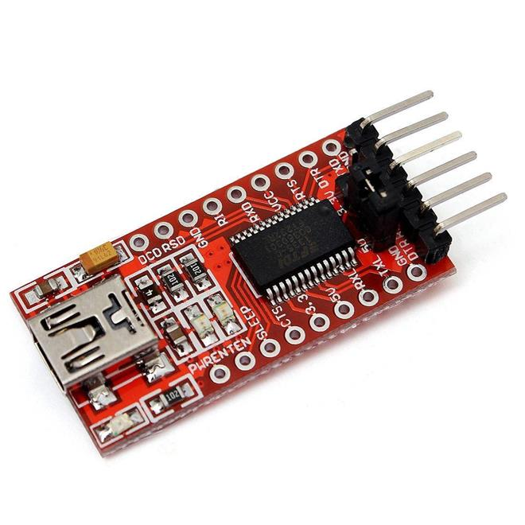

#### Digispark Micro
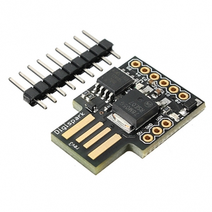

#### XBee (radio)
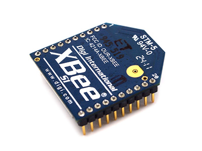

#### DFRobot Motor Shield 
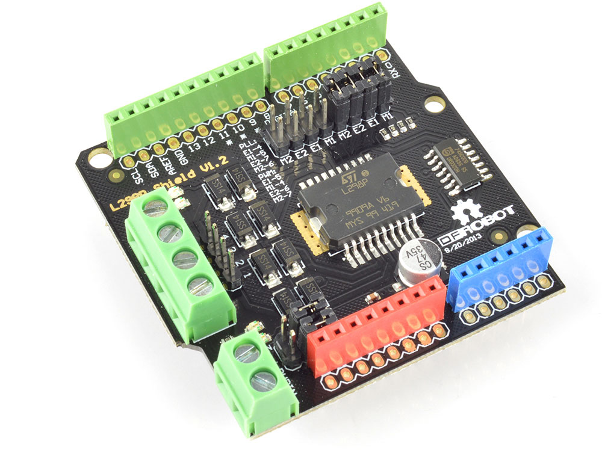

#### Adafruit Motor Shield v2
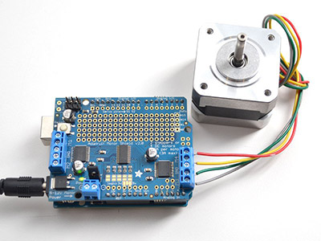

#### Servo motor(s)
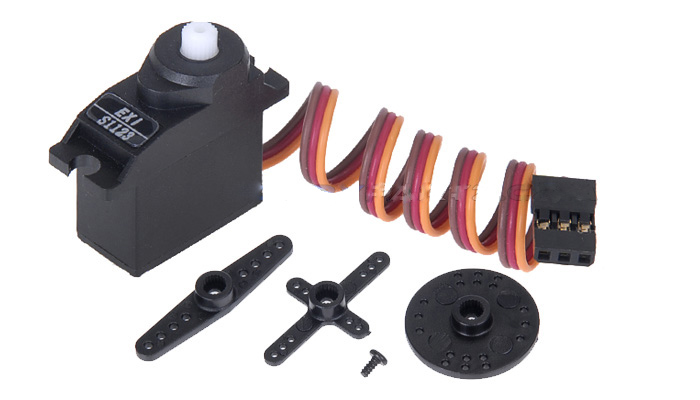

#### Relay Shields
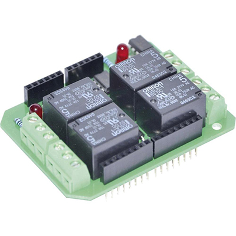
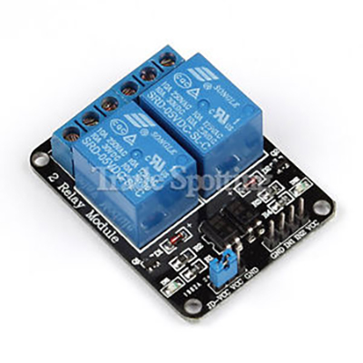
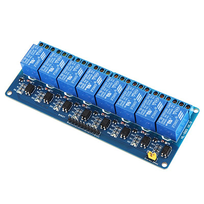

#### Adafruit Motorshield
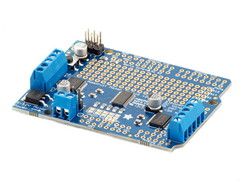

#### 16 button keyboard
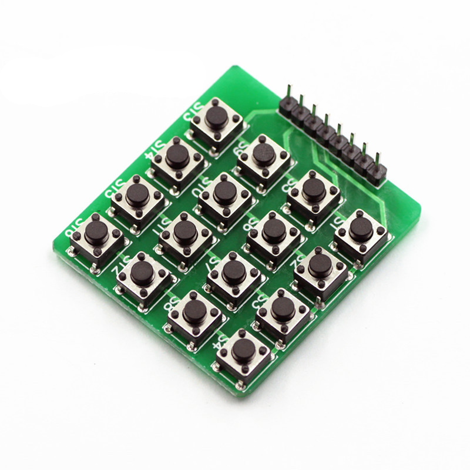

#### Arduino Ethernet Shield

## Sensors Arduino ----------------- (Google translate...)
 
* temperature sensor module
* vibration switching module
* Hall magnetic field sensor module
* Test module
* infrared transmitter module
* Passive piezo buzzer module
* RGB LED SMD module
* Lighting module
* 2-color [red + green] 5mm LED module
* Active piezo buzzer module
* temperature sensor module
* Combisensor Temperature + Humidity
* RGB 5 mm LED module
* Test module
* photo resistor module
* 5V relay module
* tilt switch module
* mini-magnet drive module
* infrared receiver module
* joystick module (XY axes)
* Linear-magnetic Hall sensor
* travel module
* flame sensor module
* Magic Light Cup module
* temperature sensor module (thermistor)
* 2-color [red + green] 3 mm LED module
* valve sensor module
* Obstacle Detector Module
* Tracking Sensor Module
* 7 color LED flash module
* Bihor Magnetic Sensor Module
* Metal Touch Sensor Module
* Microphone Sensor Module [High Sensitivity]
* microphone sound module
* heart rate sensor module
* Coded Rotary Encoder (Rotary Encoder)

<!-- ----------------------------------------  -->
# Hardware

#### Raspberry Pi 3 Model B+
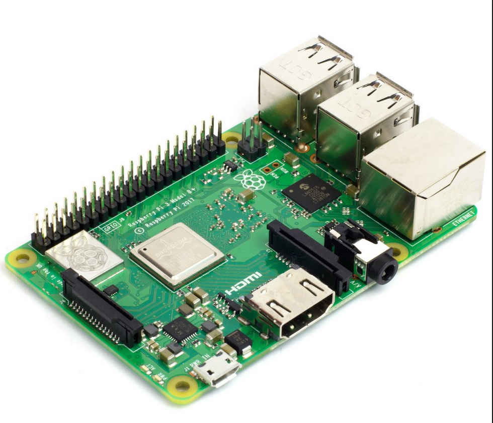

#### Raspberry Pi Camera
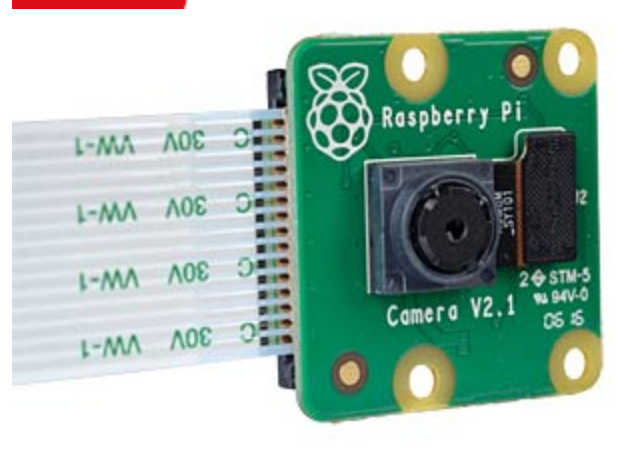

#### iPad Pro
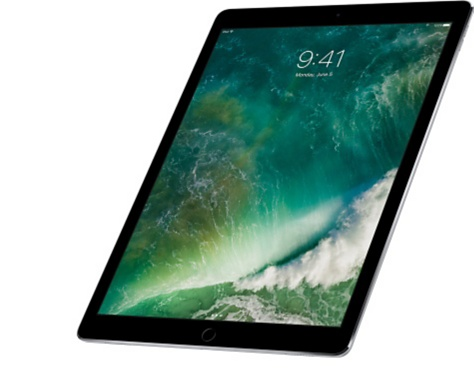

#### Motu Audio Express
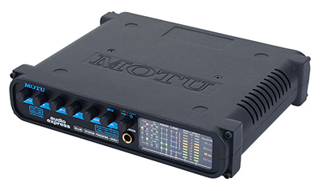

#### USB Microscope
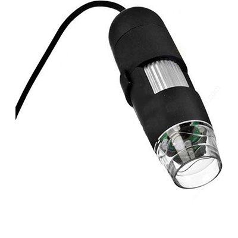

#### USB Telescope
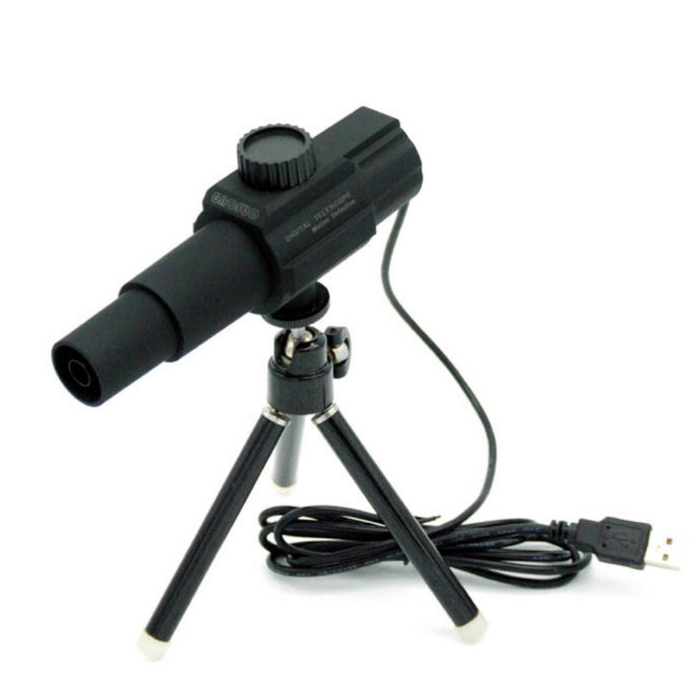

#### Webcam
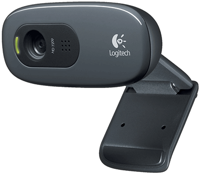

#### 125fps Webcam
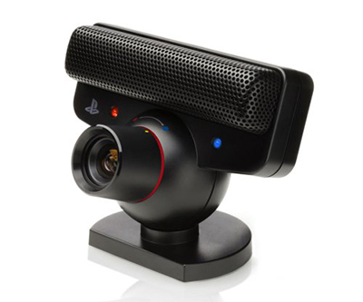

#### Heat Camera (for Android)
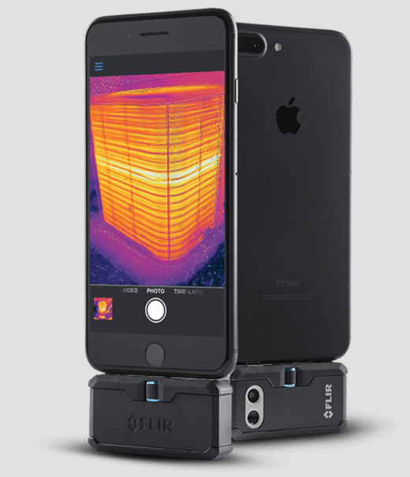

#### High Gain Wireless USB Adapter (TL-WN822N)
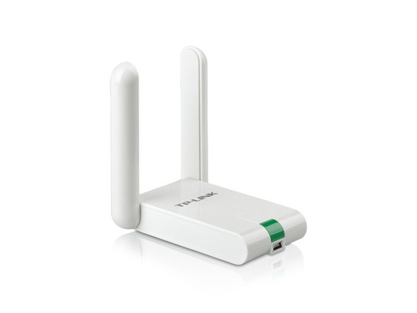

#### Barcode Scanner
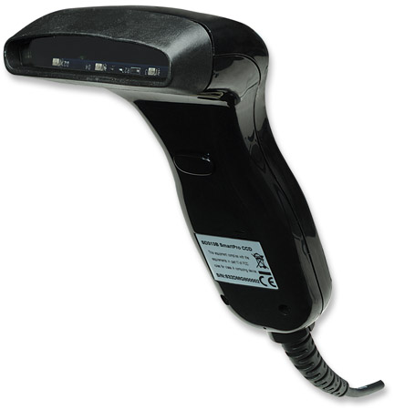

#### Gopro
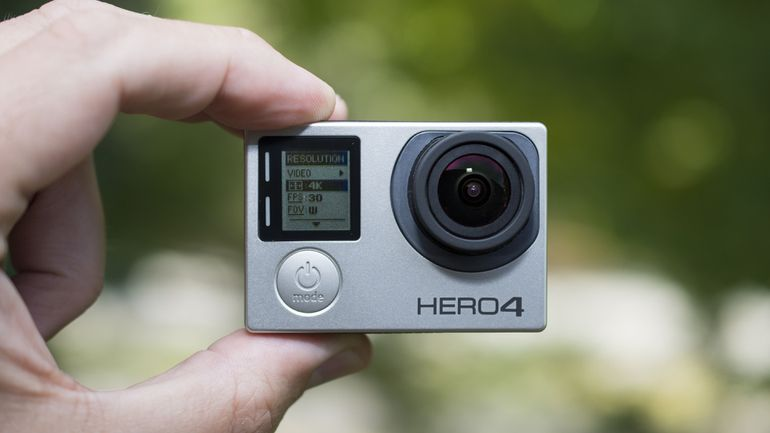

#### Hanging Scale
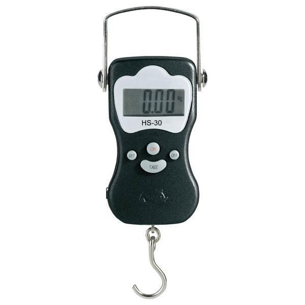

#### HTC Vive

<!-- ----------------------------------------  -->
## Human Interfaces

#### Kinect
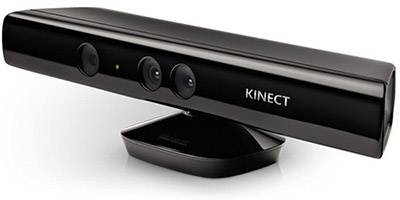

#### Leap Motion

#### Wacom Tablet
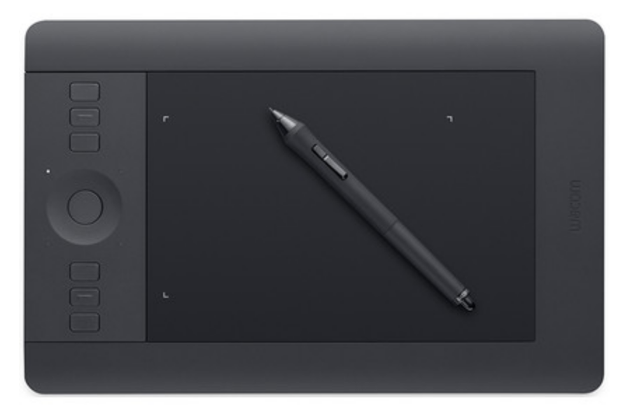

