<!--
# Table of Contents
 * [Electronics](#Electronics)
 * [Hardware](#Hardware)
-->

<!-- ----------------------------------------  -->
<!-- ----------------------------------------  -->
# Electronics

#### Arduino Mega

#### Arduino Uno

#### Arduino Leonardo

#### Arduino Pro Mini

#### Arduino Program Downloader

#### Digispark Micro

#### XBee

#### DFRobot Motor Shield 

#### Servo motor(s)

#### Relay Shields

#### Adafruit Motorshield

#### 16 button keyboard

#### Arduino Ethernet Shield
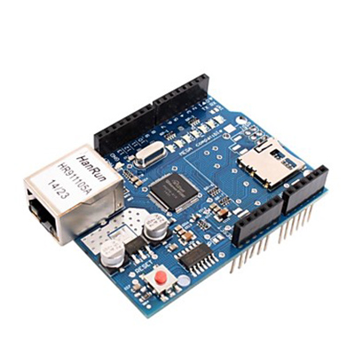

## Sensors Arduino ----------------- (Google translate...)
 
* temperature sensor module
* vibration switching module
* Hall magnetic field sensor module
* Test module
* infrared transmitter module
* Passive piezo buzzer module
* RGB LED SMD module
* Lighting module
* 2-color [red + green] 5mm LED module
* Active piezo buzzer module
* temperature sensor module
* Combisensor Temperature + Humidity
* RGB 5 mm LED module
* Test module
* photo resistor module
* 5V relay module
* tilt switch module
* mini-magnet drive module
* infrared receiver module
* joystick module (XY axes)
* Linear-magnetic Hall sensor
* travel module
* flame sensor module
* Magic Light Cup module
* temperature sensor module (thermistor)
* 2-color [red + green] 3 mm LED module
* valve sensor module
* Obstacle Detector Module
* Tracking Sensor Module
* 7 color LED flash module
* Bihor Magnetic Sensor Module
* Metal Touch Sensor Module
* Microphone Sensor Module [High Sensitivity]
* microphone sound module
* heart rate sensor module
* Coded Rotary Encoder (Rotary Encoder)

<!-- ----------------------------------------  -->
# Hardware

#### Raspberry Pi
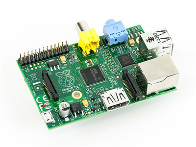

#### Orange-Pi-One
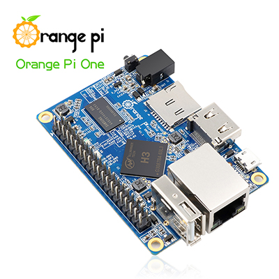

#### Raspberry Pi Infrared-Camera
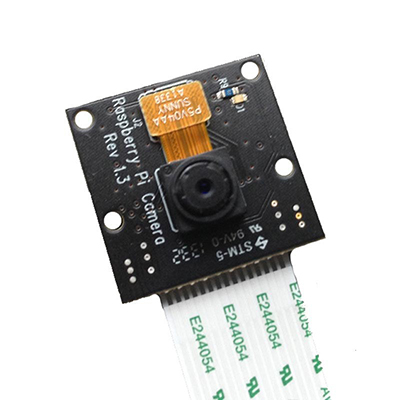

#### iPad Pro

#### Motu Audio Express

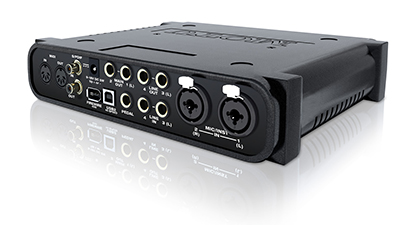

#### USB Microscope

#### Webcam

#### 125fps Webcam

#### High Gain Wireless USB Adapter (TL-WN822N)

#### OTT TV Box
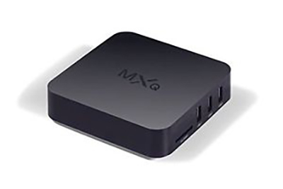

#### Barcode Scanner
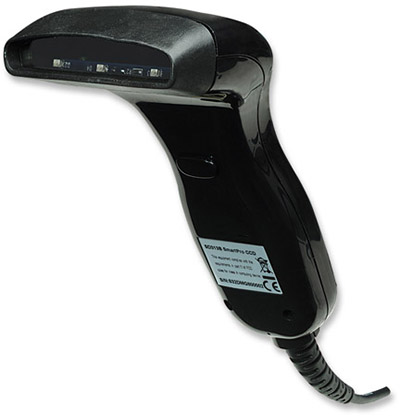

#### Sound Recorder
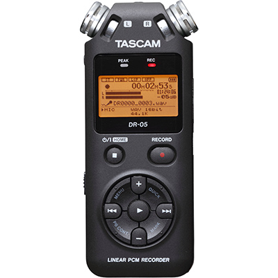

#### Gopro
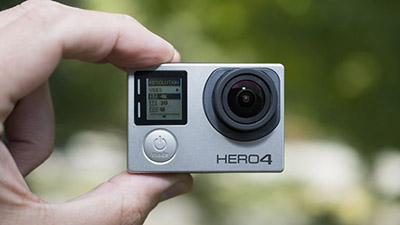

#### Phantom 4 Drone
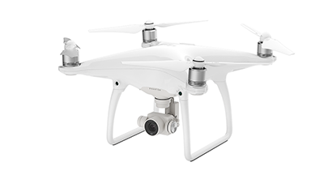

#### Hanging Scale

#### Google Cardboard
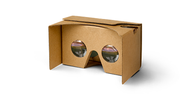

#### HTC Vive

<!-- ----------------------------------------  -->
## Human Interfaces

#### Kinect

#### Leap Motion
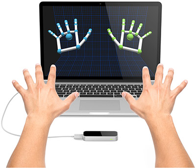

#### Wii Remote Plus
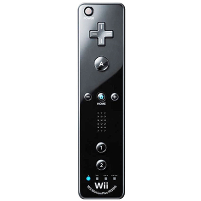
